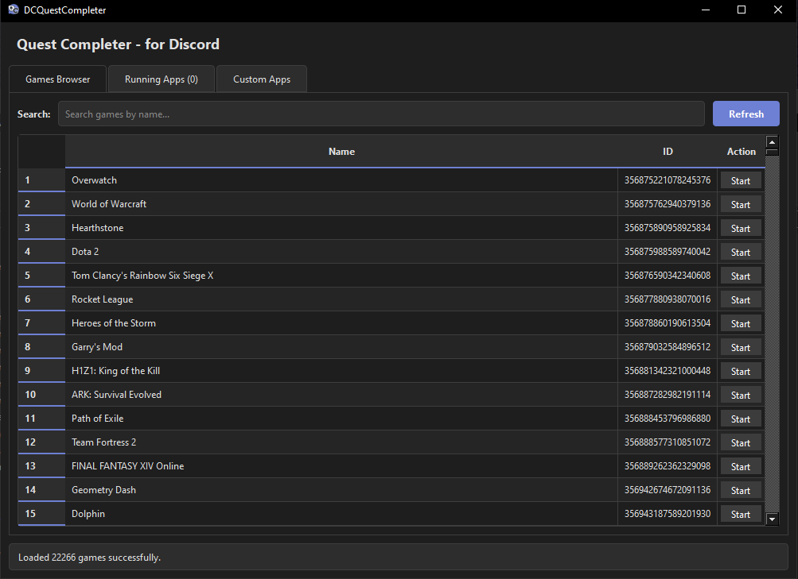

  

<h1 align="center">DCQuestCompleter</h1>

  Application which allows to complete Discord quests for games without installing the actual games. 

---

  
  

  

## ✨ Features

- Automatic game list fetching from Discord API
- Setting timer for multiple dummy games
- Automatic files deletion (on application close/dummy game close/pressing button)
- Adding custom apps
- No collecting/sending data
- Running locally without the need for internet (needed only to fetch/update game list)

## 📦 Installation

### Windows
Download the latest pre-built version from the [GitHub Releases](https://github.com/Wardiusz/DCQuestCompleter/releases) page.

## 📦 Uninstallation

### Windows
Just delete whole folder which you previously downloaded and delete folder from `%LOCALAPPDATA%\Temp\DCQuestCompleter`.

## ⚙️ How it works
1. App fetch the list of detectable games from Discord's API.
2. When you start a game, it creates a temporary small executable and/or path in AppData folder. (`%LOCALAPPDATA%\Temp\DCQuestCompleter`).
3. Discord detects it as a game and displays it as activity on your profile
4. When stopped by any means, the temporary files are automatically terminated

## 💻Usage
1. Launch DCQuestCompleter with libraries and `runner.exe` inside the same folder.
2. From `Game Browser` tab start any game you want by clicking `Start` button (for example Overwatch).
3. Dummy game will start/appear and will be added to 'Running Games' tab.
4. In `Running Games` tab click `Stop` to kill the dummy game.

## 🧰 Tech Stack

- C++ 20
- Qt 6.9.3
- CMake 3.16

## ⚠️ Disclaimer

This application is for entertainment purposes only. Use responsibly and in accordance with Discord's Terms of Service.

## 🤝 Contributing

Pull requests are welcome! Feel free to open issues or submit pull requests.

## 📄 License

MIT License  
See `LICENSE` file for details.

## Acknowledgements
Thanks to [Discord](https://discord.com/) for pushing me to install several games over funking 50GB+ in size each only to play them for like 15 minutes, then uninstall just to get the orbs.

Icon inspired by [Vesktop](https://vesktop.dev/).